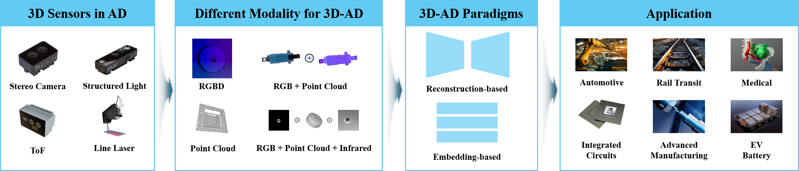

# Awesome 3D Anomaly Detection [](https://github.com/sindresorhus/awesome)

We discuss public datasets and related studies in detail. Welcome to read our paper and make comments. 

We warmly welcome any new work that we may have overlooked. 

⭐⭐⭐ We have made a preprint of a review available on ResearchGate, which will be updated regularly.

[3D Anomaly Detection: A Survey](https://www.researchgate.net/publication/398334588_3D_Anomaly_Detection_A_Survey) [**updated: v4 2026/1/8**]



🔥🔥🔥 Contributions to our repository are welcome. Feel free to categorize the papers and pull requests.

## Conference Summary
- [A. AAAI2026](#a-aaai2026)

## Table of Contents
- [1. Multimodal 3D Anomaly Detection](#1-multimodal-3d-anomaly-detection)
  - [1.1 Depth(2.5D)+RGB](#11-depth25drgb)
    - [1.1.1 Feature-embedding Method](#111-feature-embedding-method)
    - [1.1.2 Feature-reconstruction Method](#112-feature-reconstruction-method)
      - [1.1.2.1 U-Net Method](#1121-u-net-method)
      - [1.1.2.2 Autoencoder-based Method](#1122-autoencoder-based-method)
  - [1.2 Point Cloud+RGB](#12-point-cloudrgb)
    - [1.2.1 Feature-embedding Method](#121-feature-embedding-method)
      - [1.2.1.1 Teacher-Student Method](#1211-teacher-student-method)
      - [1.2.1.2 Memory-bank Method](#1212-memory-bank-method)
    - [1.2.2 Feature-reconstruction Method](#122-feature-reconstruction-method)
      - [1.2.2.1 Transformer-based Method](#1221-transformer-based-method)
      - [1.2.2.2 Flow-based Method](#1222-flow-based-method)
      - [1.2.2.3 GAN-based Method](#1223-gan-based-method)
      - [1.2.2.4 Autoencoder-based Method](#1224-autoencoder-based-method)
  - [1.3 Beyond Unimodal](#13-beyond-unimodal)
- [2. PointCloud 3D Anomaly Detection](#2-pointcloud-3d-anomaly-detection)
  - [2.1 Feature-reconstruction Method](#21-feature-reconstruction-method)
    - [2.1.1 Transformer-based Method](#211-transformer-based-method)
    - [2.1.2 Offset-based Method](#212-offset-based-method)
    - [2.1.3 Shape descriptor Method](#213-shape-descriptor-method)
  - [2.2 Feature-embedding Method](#22-feature-embedding-method)
    - [2.2.1 Handcrafted Mathematical Operators](#221-handcrafted-mathematical-operators)
    - [2.2.2 Deep Feature Extractors](#222-deep-feature-extractors)
    - [2.2.3 Multi-view Feature Representation](#223-multi-view-feature-representation)
  - [2.3 Zero-shot LLM Method](#23-zero-shot-llm-method)
- [3. Pose-agnostic 3D Anomaly Detection](#3-pose-agnostic-3d-anomaly-detection)
  - [3.1 Multi-view](#31-multi-view)
  - [3.2 Image-query](#32-image-query)
- [4. Datasets and Metrics](#4-datasets-and-metrics)
  - [4.1 M3AD (MvTec3D-AD...)](#41-m3ad-mvtec3d-ad)
  - [4.2 PA3AD (MAD...)](#42-pa3ad-mad)
  - [4.3 PC3AD (Real3D-AD...)](#43-pc3ad-real3d-ad)

---

## A. AAAI2026
1. Point Cloud Segmentation of Integrated Circuits Package Substrates Surface Defects Using Causal Inference: Dataset Construction and Methodology [[AAAI 2026]](https://arxiv.org/abs/2511.05853v1) [[code]](https://github.com/Bingyang0410/CPS3D-Seg)
2. Commonality in Few: Few-Shot Multimodal Anomaly Detection via Hypergraph-Enhanced Memory [[AAAI 2026]](https://arxiv.org/abs/2511.05966) [[code]](https://github.com/Sunny5250/CIF)
3. CASL: Curvature-Augmented Self-supervised Learning for 3D Anomaly Detection [[AAAI 2026]](https://arxiv.org/pdf/2511.12909) [[code]](https://github.com/zyh16143998882/CASL)
## 1. Multimodal 3D Anomaly Detection

### 1.1 Depth(2.5D)+RGB

#### 1.1.1 Feature-embedding Method
1. **[2022]** Asymmetric Student-Teacher Networks for Industrial Anomaly Detection [[WACV 2022]](https://arxiv.org/pdf/2210.07829.pdf)
2. **[2024]** LPFSTNet: A lightweight and parameter-free head attention-based student–teacher network for fast 3D industrial anomaly detection [[Neurocomputing]](https://www.sciencedirect.com/science/article/abs/pii/S0925231225000803)
3. **[2024]** Rethinking Reverse Distillation for Multi-Modal Anomaly Detection [[AAAI 2024]](https://ojs.aaai.org/index.php/AAAI/article/view/28687)
4. **[2025]** Real-IAD D3: A Real-World 2D/Pseudo-3D/3D Dataset for Industrial Anomaly Detection [[Arxiv]](https://realiad4ad.github.io/Real-IAD/) [[code]](https://github.com/Tencent/AnomalyDetection_Real-IAD)
5. **[2024]** Cross-Modal Distillation in Industrial Anomaly Detection: Exploring Efficient Multi-Modal IAD [[Information Fusion]](https://arxiv.org/abs/2405.13571) [[code]](https://github.com/evenrose/CMDIAD)

#### 1.1.2 Feature-reconstruction Method

##### 1.1.2.1 U-Net Method
1. **[2023]** EasyNet: An Easy Network for 3D Industrial Anomaly Detection [[ACM MM 2023]](https://arxiv.org/abs/2307.13925) [[code]](https://github.com/TaoTao9/EasyNet/blob/main/README.md)
2. **[2023]** Dual-Branch Reconstruction Network for Industrial Anomaly Detection with RGB-D Data [[EIT]](https://ietresearch.onlinelibrary.wiley.com/doi/10.1049/ell2.13289?af=R)
3. **[2025]** A Local Anomaly Detection Method for Occluded Targets with Multispectral Point Clouds [[IGARSS 2025]](https://ieeexplore.ieee.org/document/11243660)

##### 1.1.2.2 Autoencoder-based Method
1. **[2024]** Cheating Depth: Enhancing 3D Surface Anomaly Detection via Depth Simulation [[WACV 2024]](https://openaccess.thecvf.com/content/WACV2024/papers/Zavrtanik_Cheating_Depth_Enhancing_3D_Surface_Anomaly_Detection_via_Depth_Simulation_WACV_2024_paper.pdf) [[code]](https://github.com/VitjanZ/3DSR)
2. **[2024]** Keep DRÆMing: Discriminative 3D anomaly detection through anomaly simulation [[PRL 2024]](https://www.sciencedirect.com/science/article/pii/S0167865524000862)
3. **[2024]** 3D Industrial anomaly detection via dual reconstruction network [[Applied Intelligence]](https://link.springer.com/article/10.1007/s10489-024-05700-x)
4. **[2025]** Revisiting Multimodal Fusion for 3D Anomaly Detection from an Architectural Perspective [[AAAI 2025]](https://arxiv.org/abs/2412.17297) [[code]](https://github.com/longkaifang/3D-ADNAS)
5. **[2025]** AnomalyHybrid: A Domain-agnostic Generative Framework for General Anomaly Detection [[CVPR 2025 SyntaGen Workshop]](https://openaccess.thecvf.com/content/CVPR2025W/SyntaGen/papers/Zhao_AnomalyHybrid_A_Domain-agnostic_Generative_Framework_for_General_Anomaly_Detection_CVPRW_2025_paper.pdf)
6. **[2025]** BridgeNet: A Unified Multimodal Framework for Bridging 2D and 3D Industrial Anomaly Detection [[MM2025]](https://arxiv.org/pdf/2507.19253) [[code]](https://github.com/Xantastic/BridgeNet)
7. **[2025]** DAS3D: Dual-modality Anomaly Synthesis for 3D Anomaly Detection [[Arxiv]](https://arxiv.org/abs/2412.08949) [[code]](https://github.com/hito2448/TRD)

### 1.2 Point Cloud+RGB

#### 1.2.1 Feature-embedding Method

##### 1.2.1.1 Teacher-Student Method
1. **[2022]** Anomaly detection in 3d point clouds using deep geometric descriptors [[WACV2022]](https://www.scitepress.org/Link.aspx?doi=10.5220/0010865000003124)
2. **[2022]** The MVTec 3D-AD Dataset for Unsupervised 3D Anomaly Detection and Localization [[VISAPP2022]](https://www.scitepress.org/Link.aspx?doi=10.5220/0010865000003124)
3. **[2024]** Memoryless Multimodal Anomaly Detection via Student-Teacher Network and Signed Distance Learning [[PRCV2024]](https://arxiv.org/abs/2409.05378)
4. **[2024]** Tuned Reverse Distillation: Enhancing Multimodal Industrial Anomaly Detection with Crossmodal Tuners [[Arxiv]](https://arxiv.org/abs/2412.08949) [[code]](https://github.com/hito2448/TRD)
5. **[2024]** Incomplete Multimodal Industrial Anomaly Detection via Cross-Modal Distillation [[Arxiv]](https://arxiv.org/pdf/2405.13571)
6. **[2025]** FIND: Few-Shot Anomaly Inspection with Normal-Only Multi-Modal Data [[ICCV2025]](https://openaccess.thecvf.com/content/ICCV2025/html/Li_FIND_Few-Shot_Anomaly_Inspection_with_Normal-Only_Multi-Modal_Data_ICCV_2025_paper.html)
7. **[2025]** A method for anomaly detection of track bed based on multimodal feature fusion [[CIOP]](https://www.spiedigitallibrary.org/conference-proceedings-of-spie/13990/1399045/A-method-for-anomaly-detection-of-track-bed-based-on/10.1117/12.3088067.short)

##### 1.2.1.2 Memory-bank Method
1. **[2023]** Back to the feature: classical 3d features are (almost) all you need for 3D anomaly detection [[CVPRW2023]](https://arxiv.org/pdf/2203.05550.pdf) [[code]](https://github.com/eliahuhorwitz/3D-ADS)
2. **[2023]** Multimodal Industrial Anomaly Detection via Hybrid Fusion [[CVPR 2023]](https://arxiv.org/abs/2303.00601) [[code]](https://github.com/nomewang/M3DM)
3. **[2024]** M3DM-NR: RGB-3D Noisy-Resistant Industrial Anomaly Detection via Multimodal Denoising [[TPAMI]](https://arxiv.org/abs/2406.02263)
4. **[2023]** Shape-Guided Dual-Memory Learning for 3D Anomaly Detection [[ICML 2023]](https://openreview.net/forum?id=IkSGn9fcPz)
5. **[2024]** Self-supervised Feature Adaptation for 3D Industrial Anomaly Detection [[Arxiv]](https://arxiv.org/abs/2401.03145)
6. **[2024]** DAUP: Enhancing point cloud homogeneity for 3D industrial anomaly detection via density-aware point cloud upsampling [[AEI]](https://www.sciencedirect.com/science/article/pii/S1474034624004713)
7. **[2025]** VLDFNet: Views-Graph and Latent Feature Disentangled Fusion Network for Multimodal Industrial Anomaly Detection [[TIM 2025]](https://ieeexplore.ieee.org/document/11004494)
8. **[2025]** Commonality in Few: Few-Shot Multimodal Anomaly Detection via Hypergraph-Enhanced Memory [[AAAI 2026]](https://arxiv.org/abs/2511.05966) [[code]](https://github.com/Sunny5250/CIF)
9. **[2025]** Multimodal Industrial Anomaly Detection via Attention-Enhanced Memory-Guided Network [[TMM]](https://ieeexplore.ieee.org/document/11248961)

#### 1.2.2 Feature-reconstruction Method

##### 1.2.2.1 Transformer-based Method
1. **[2024]** Multimodal Industrial Anomaly Detection by Crossmodal Feature Mapping [[CVPR2024]](https://arxiv.org/abs/2312.04521) [[code]](https://github.com/CVLAB-Unibo/crossmodal-feature-mapping)
2. **[2025]** Fusion-restoration model for industrial multimodal anomaly detection [[Neurocomputing]](https://www.sciencedirect.com/science/article/pii/S0925231225007453)
3. **[2025]** Multimodal Industrial Anomaly Detection via Uni-Modal and Cross-Modal Fusion [[TII]](https://ieeexplore.ieee.org/stamp/stamp.jsp?tp=&arnumber=10948502)
4. **[2025]** 3D-MMFN: Multi-level Multimodal Fusion Network for 3D Industrial Image Anomaly Detection [[AEI]](https://www.sciencedirect.com/science/article/abs/pii/S1474034625001776) [[code]](https://github.com/asadmujtaba/3DMMFN)
5. **[2025]** 2D–3D Feature Fusion via Cross-Modal Latent Synthesis and Attention-Guided Restoration for Industrial Anomaly Detection [[DICTA2025]](https://arxiv.org/pdf/2510.21793) [[code]](https://github.com/adabrh/MAFR)
6. **[2025]** Unsupervised 3D Anomaly Detection Method Using Fusion of Point Cloud and Image Features [[SAFEPROCESS]](https://ieeexplore.ieee.org/document/11267808)
7. **[2025]** Multimodal Industrial Anomaly Detection via Geometric Prior [[TCSVT]](https://ieeexplore.ieee.org/document/11178073)

##### 1.2.2.2 Flow-based Method
1. **[2025]** MADFlow: Multimodal difference compensation flow for multimodal anomaly detection [[Neurocomputing]](https://www.sciencedirect.com/science/article/pii/S0925231225019150)
2. **[2025]** 2M3DF: Advancing 3D Industrial Defect Detection With Multi-Perspective Multimodal Fusion Network [[TCSVT]](https://ieeexplore.ieee.org/document/10858074)

##### 1.2.2.3 GAN-based Method
1. **[2024]** Uni-3DAD: GAN-Inversion Aided Universal 3D Anomaly Detection on Model-free Products [[ESWA]](https://arxiv.org/abs/2408.16201) [[code]](https://github.com/JiayuLiu666/Uni3DAD)

##### 1.2.2.4 Autoencoder-based Method
1. **[2024]** Incremental Template Neighborhood Matching for 3D anomaly detection [[Neurocomputing]](https://www.sciencedirect.com/science/article/abs/pii/S0925231224002546)
2. **[2025]** G$^2$SF: Geometry-Guided Score Fusion for Multimodal Industrial Anomaly Detection [[ICCV2025]](https://arxiv.org/html/2503.10091v1)
3. **[2025]** CPIR: Multimodal Industrial Anomaly Detection via Latent Bridged Cross-modal Prediction and Intra-modal Reconstruction [[AEI]](https://www.sciencedirect.com/science/article/pii/S1474034625001338)
4. **[2025]** HFMM-Net: A Hybrid Fusion Mamba Network for Efficient Multimodal Industrial Defect Detection [[Information]](https://www.mdpi.com/2078-2489/16/12/1018)

### 1.3 Beyond Unimodal
1. **[2025]** Multi-Sensor Object Anomaly Detection: Unifying Appearance, Geometry, and Internal Properties [[CVPR2025]](https://arxiv.org/abs/2412.14592) [[code]](https://github.com/ZZZBBBZZZ/MulSen-AD/)

## 2. PointCloud 3D Anomaly Detection

### 2.1 Feature-reconstruction Method

#### 2.1.1 Transformer-based Method
1. **[2021]** Toward Unsupervised 3D Point Cloud Anomaly Detection using Variational Autoencoder [[ICIP2021]](https://arxiv.org/abs/2304.03420) [[code]](https://github.com/llien30/point_cloud_anomaly_detection)
2. **[2024]** Anomaly-ShapeNet: A Synthetic Dataset of Point Cloud Anomaly Detection [[CVPR2024]](https://github.com/Chopper-233/Anomaly-ShapeNet) [[code]](https://github.com/Chopper-233/Anomaly-ShapeNet)
3. **[2025]** Taming Anomalies with Down-Up Sampling Networks: Group Center Preserving Reconstruction for 3D Anomaly Detection [[MM2025]](https://arxiv.org/abs/2507.03903#:~:text=In%20this%20study%2C%20a%20Down-Up%20Sampling%20Network%20%28DUS-Net%29,detection%20by%20preserving%20the%20group%20center%20geometric%20structure.)
4. **[2025]** MC3D-AD: A Unified Geometry-aware Reconstruction Model for Multi-category 3D Anomaly Detection [[IJCAI2025]](https://arxiv.org/abs/2505.01969) [[code]](https://github.com/iCAN-SZU/MC3D-AD)
5. **[2025]** C3D-AD: Toward Continual 3D Anomaly Detection via Kernel Attention with Learnable Advisor [[Arxiv2025]](https://arxiv.org/abs/2508.01311) [[code]](https://github.com/hzzzzzhappy/C3DAD)
6. **[2025]** Anomaly-Aware Siamese Comparative Transformer for 3D Anomaly Detection [[SSRN]](https://papers.ssrn.com/sol3/papers.cfm?abstract_id=5555382)

#### 2.1.2 Offset-based Method
1. **[2024]** R3D-AD: Reconstruction via Diffusion for 3D Anomaly Detection [[ECCV2024]](https://arxiv.org/abs/2407.10862) [[code]](https://zhouzheyuan.github.io/r3d-ad)
2. **[2025]** PO3AD: Predicting Point Offsets toward Better 3D Point Cloud Anomaly Detection [[CVPR2025]](https://arxiv.org/abs/2412.12617) [[code]](https://github.com/yjnanan/PO3AD)
3. **[2025]** Examining the Source of Defects from a Mechanical Perspective for 3D Anomaly Detection [[Arxiv]](https://arxiv.org/abs/2505.05901) [[code]](https://github.com/hzzzzzhappy/MC4AD)
4. **[2025]** UCA-3DAL: A Unified Contrastive Framework with Test-Time Adaptation for Robust 3D Anomaly Localization [[Arxiv]](https://www.researchgate.net/publication/398446535_A_Unified_Contrastive_Framework_with_Test-Time_Adaptation_for_Robust_3D_Anomaly_Localization) [[code]](https://github.com/M-3LAB/UCA-3DL)

#### 2.1.3 Shape descriptor Method
1. **[2023]** Shape-Guided Dual-Memory Learning for 3D Anomaly Detection [[ICML2023]](https://openreview.net/pdf?id=IkSGn9fcPz) [[code]](https://github.com/jayliu0313/Shape-Guided)
2. **[2024]** 3D-CSAD: Untrained 3D Anomaly Detection for Complex Manufacturing Surfaces [[Arxiv]](https://arxiv.org/abs/2404.07748)
3. **[2025]** Bridging 3D Anomaly Localization and Repair via High-Quality Continuous Geometric Representation [[ICCV2025]](https://arxiv.org/abs/2505.24431) [[code]](https://github.com/ZZZBBBZZZ/PASDF)
4. **[2025]** Exploiting Point-Language Models with Dual-Prompts for 3D Anomaly Detection [[Arxiv]](https://arxiv.org/abs/2502.11307)
5. **[2025]** 3DKeyAD: High-Resolution 3D Point Cloud Anomaly Detection via Keypoint-Guided Point Clustering [[Arxiv]](https://arxiv.org/pdf/2507.13110)
6. **[2025]** 3D-PNAS: 3D Industrial Surface Anomaly Synthesis with Perlin Noise [[Arxiv]](https://arxiv.org/abs/2504.12856)
7. **[2025]** Deep Subspace Learning for Surface Anomaly Classification Based on 3D Point Cloud Data [[Arxiv]](https://arxiv.org/pdf/2502.11669)
8. **[2025]** CASL: Curvature-Augmented Self-supervised Learning for 3D Anomaly Detection [[AAAI 2026]](https://arxiv.org/pdf/2511.12909) [[code]](https://github.com/zyh16143998882/CASL)

### 2.2 Feature-embedding Method

#### 2.2.1 Handcrafted Mathematical Operators
1. **[2022]** Anomaly Detection in 3D Point Clouds using Deep Geometric Descriptors [[WACV 2022]](https://arxiv.org/abs/2202.11660)
2. **[2023]** Back to the Feature: Classical 3D Features are (Almost) All You Need for 3D Anomaly Detection [[CVPRW2023]](https://openaccess.thecvf.com/content/CVPR2023W/VAND/papers/Horwitz_Back_to_the_Feature_Classical_3D_Features_Are_Almost_All_CVPRW_2023_paper.pdf) [[code]](https://github.com/eliahuhorwitz/3D-ADS/blob/main/README.md)
3. **[2024]** Anomaly detection of cracks in synthetic masonry arch bridge point clouds using fast point feature histograms and PatchCore [[Automation in Construction2025]](https://www.sciencedirect.com/science/article/pii/S0926580524005028) [[code]](https://github.com/Jingyixiong/patchcore_masonrybridge)
4. **[2024]** Complementary Pseudo Multimodal Feature for Point Cloud Anomaly Detection [[PR2024]](https://www.sciencedirect.com/science/article/abs/pii/S0031320324005120) [[code]](https://github.com/caoyunkang/CPMF)
5. **[2024]** PointCore: Efficient Unsupervised Point Cloud Anomaly Detector Using Local-Global Features [[Arxiv]](https://arxiv.org/abs/2403.01804)
6. **[2025]** Fence Theorem: Towards Dual-Objective Semantic-Structure Isolation in Preprocessing Phase for 3D Anomaly Detection [[ICCVW2025]](https://arxiv.org/abs/2503.01100v2)
7. **[2025]** Towards High-Resolution 3D Anomaly Detection: A Scalable Dataset and Real-Time Framework for Subtle Industrial Defects [[Arxiv]](https://arxiv.org/abs/2507.07435) [[code]](https://github.com/hustCYQ/MiniShift-Simple3D/blob/main/README.md)
8. **[2025]** 3D multimodal feature for infrastructure anomaly detection [[Automation in Construction2025]](https://arxiv.org/pdf/2502.05779) [[code]](https://github.com/Jingyixiong/3D-Multi-FPFHI)
9. **[2025]** Position: Untrained Machine Learning for Anomaly Detection by using 3D Point Cloud Data [[Arxiv]](https://arxiv.org/abs/2502.03876)

#### 2.2.2 Deep Feature Extractors
1. **[2022]** Teacher-Student Network for 3D Point Cloud Anomaly Detection with Few Normal Samples [[Arxiv2022]](https://arxiv.org/abs/2210.17258)
2. **[2023]** Towards Total Recall in Industrial Anomaly Detection [[CVPR2023]](https://arxiv.org/abs/2106.08265) [[code]](https://github.com/M-3LAB/Real3D-AD/tree/main/patchcore)
3. **[2023]** Real3D-AD: A Dataset of Point Cloud Anomaly Detection [[NeurIPS2023]](https://proceedings.neurips.cc/paper_files/paper/2023/hash/611b896d447df43c898062358df4c114-Abstract-Datasets_and_Benchmarks.html) [[code]](https://github.com/m-3lab/real3d-ad)
4. **[2024]** Towards High-resolution 3D Anomaly Detection via Group-Level Feature Contrastive Learning [[MM2024]](https://dl.acm.org/doi/abs/10.1145/3664647.3680919)
5. **[2024]** Look Inside for More: Internal Spatial Modality Perception for 3D Anomaly Detection [[AAAI2025]](https://arxiv.org/abs/2412.13461) [[code]](https://github.com/M-3LAB/Look-Inside-for-More)
6. **[2025]** Boosting Global-Local Feature Matching via Anomaly Synthesis for Multi-Class Point Cloud Anomaly Detection [[TASE]](https://ieeexplore.ieee.org/document/10898004) [[code]](https://github.com/hustCYQ/GLFM-Multi-class-3DAD/blob/main/README.md)
7. **[2025]** Registration is a Powerful Rotation-Invariance Learner for 3D Anomaly Detection [[NIPS2025]](https://arxiv.org/abs/2510.16865) [[code]](https://github.com/CHen-ZH-W/Reg2Inv)
8. **[2025]** Robust Distribution Alignment for Industrial Anomaly Detection under Distribution Shift [[Arxiv]](https://arxiv.org/abs/2503.14910)
9. **[2025]** A Lightweight 3D Anomaly Detection Method with Rotationally Invariant Features  [[Arxiv]](https://arxiv.org/abs/2511.13115) [[code]](https://github.com/hzzzzzhappy/RIF/blob/main/README.md)
10. **[2025]** Unsupervised Feature Metric-Based Multimodal Anomaly Detection Method [[CAIBDA]](https://ieeexplore.ieee.org/document/11183147)

#### 2.2.3 Multi-view Feature Representation
1. **[2024]** Complementary Pseudo Multimodal Feature for Point Cloud Anomaly Detection [[PR2024]](https://www.sciencedirect.com/science/article/abs/pii/S0031320324005120) [[code]](https://github.com/caoyunkang/CPMF)
2. **[2024]** Look Inside for More: Internal Spatial Modality Perception for 3D Anomaly Detection [[AAAI2025]](https://arxiv.org/abs/2412.13461) [[code]](https://github.com/M-3LAB/Look-Inside-for-More)
3. **[2024]** Looking 3D: Anomaly Detection with 2D-3D Alignment [[CVPR2024]](https://openaccess.thecvf.com/content/CVPR2024/papers/Bhunia_Looking_3D_Anomaly_Detection_with_2D-3D_Alignment_CVPR_2024_paper.pdf) [[code]](https://github.com/VICO-UoE/Looking3D)
4. **[2025]** Multi-View Reconstruction with Global Context for 3D Anomaly Detection [[IEEE SMC]](https://arxiv.org/abs/2507.21555) [[code]](https://github.com/hustSYH/MVR/blob/master/README.md)
5. **[2025]** Probing 3D Anomalies via Multi-View Registration and Dual-Residual Analysis [[SSRN]](https://papers.ssrn.com/sol3/papers.cfm?abstract_id=5868807)

### 2.3 Zero-shot LLM Method
1. **[2023]** Towards Generic Anomaly Detection and Understanding: Large-scale Visual-linguistic Model (GPT-4V) Takes the Lead [[Arxiv2023]](https://arxiv.org/abs/2311.02782)
2. **[2024]** PointAD-Comprehending 3D Anomalies from Points and Pixels for Zero-shot 3D Anomaly Detection [[NeurIPS2024]](https://proceedings.neurips.cc/paper_files/paper/2024/hash/9a263e235f6d1521d13a8531c7974951-Abstract-Conference.html) [[code]](https://github.com/zqhang/PointAD)
3. **[2024]** Towards Zero-shot 3D Anomaly Localization [[WACV2024]](https://arxiv.org/pdf/2412.04304) [[code]](https://github.com/wyzjack/3DzAL?tab=readme-ov-file)
4. **[2024]** Towards Zero-shot Point Cloud Anomaly Detection: A Multi-View Projection Framework [[Arxiv]](https://arxiv.org/abs/2409.13162) [[code]](https://github.com/hustCYQ/MVP-PCLIP)
5. **[2024]** CLIP3D-AD: Extending CLIP for 3D Few-Shot Anomaly Detection with Multi-View Images Generation [[Arxiv]](https://arxiv.org/abs/2406.18941)
6. **[2025]** Customizing Visual-Language Foundation Models for Multi-modal Anomaly Detection and Reasoning [[IEEE ICCSCWD2025]](https://arxiv.org/pdf/2403.11083) [[code]](https://github.com/Xiaohao-Xu/Customizable-VLM)
7. **[2025]** PointAD+: Learning Hierarchical Representations for Zero-shot 3D Anomaly Detection [[Submitted to TPAMI]](https://arxiv.org/pdf/2509.03277)
8. **[2025]** MCL-AD: Multimodal Collaboration Learning for Zero-Shot 3D Anomaly Detection [[Arxiv]](https://arxiv.org/abs/2509.10282)
9. **[2025]** MuSc-V2: Zero-Shot Multimodal Industrial Anomaly Classification and Segmentation with Mutual Scoring of Unlabeled Samples [[Arxiv]](https://arxiv.org/abs/2511.10047) [[code]](https://github.com/HUST-SLOW/MuSc-V2)
10. **[2025]** On the Problem of Consistent Anomalies in Zero-Shot Anomaly Detection [[Arxiv]](https://arxiv.org/abs/2512.02520)
 
## 3. Pose-agnostic 3D Anomaly Detection

### 3.1 Multi-view
1. **[2025]** SiM3D: Single-instance Multiview Multimodal and Multisetup 3D Anomaly Detection Benchmark [[ICCV2025]](https://arxiv.org/abs/2506.21549) [[code]](https://arxiv.org/abs/2506.21549)
2. **[2025]** Real-IAD D3: A Real-World 2D/Pseudo-3D/3D Dataset for Industrial Anomaly Detection [[Arxiv]](https://realiad4ad.github.io/Real-IAD/) [[code]](https://github.com/Tencent/AnomalyDetection_Real-IAD)

### 3.2 Image-query
1. **[2023]** PAD: A Dataset and Benchmark for Pose-agnostic Anomaly Detection [[NeurIPS2023]](https://papers.nips.cc/paper/2023/file/8bc5aef775aacc1650a9790f1428bcea-Paper-Datasets_and_Benchmarks.pdf#:~:text=We%20introduced%20Pose-agnostic%20Anomaly%20Detection%20%28PAD%29%2C%20a%20challenging,forward%20to%20pratical%20anomaly%20detection%20and%20localization%20tasks.) [[code]](https://github.com/EricLee0224/PAD)
2. **[2024]** SplatPose & Detect: Pose-Agnostic 3D Anomaly Detection [[CVPRW2024]](https://arxiv.org/abs/2404.06832) [[code]](https://github.com/m-kruse98/SplatPose)
3. **[2024]** SplatPose+: Real-time Image-Based Pose-Agnostic 3D Anomaly Detection [[ECCVW2024]](https://arxiv.org/pdf/2404.06832) [[code]](https://github.com/Yizhe-Liu/SplatPosePlus)
4. **[2025]** PIAD: Pose and Illumination agnostic Anomaly Detection [[CVPR2025]](https://openaccess.thecvf.com/content/CVPR2025/papers/Yang_PIAD_Pose_and_Illumination_agnostic_Anomaly_Detection_CVPR_2025_paper.pdf) [[code]](https://github.com/Kaichen-Yang/piad_baseline)

## 4. Datasets

### 4.1 M3AD
1. **[2022]** The MVTec 3D-AD Dataset for Unsupervised 3D Anomaly Detection and Localization [[VISAPP2022]](https://www.scitepress.org/Link.aspx?doi=10.5220/0010865000003124)
2. **[2022]** The Eyecandies Dataset for Unsupervised Multimodal Anomaly Detection and Localization [[ACCV2022]](https://eyecan-ai.github.io/eyecandies/)
3. **[2023]** Image-Pointcloud Fusion based Anomaly Detection using PD-REAL Dataset [[Arxiv]](https://arxiv.org/abs/2311.04095) [[data]](https://github.com/Andy-cs008/PD-REAL)
4. **[2025]** 3D-ADAM: A Dataset for 3D Anomaly Detection in Advanced Manufacturing [[Arxiv]](https://arxiv.org/abs/2507.07838)
5. **[2025]** SiM3D: Single-instance Multiview Multimodal and Multisetup 3D Anomaly Detection Benchmark [[ICCV2025]](https://arxiv.org/abs/2506.21549) [[code]](https://arxiv.org/abs/2506.21549)
### 4.2 PA3AD
1. **[2023]** PAD: A Dataset and Benchmark for Pose-agnostic Anomaly Detection [[NeurIPS2023]](https://papers.nips.cc/paper/2023/file/8bc5aef775aacc1650a9790f1428bcea-Paper-Datasets_and_Benchmarks.pdf#:~:text=We%20introduced%20Pose-agnostic%20Anomaly%20Detection%20%28PAD%29%2C%20a%20challenging,forward%20to%20pratical%20anomaly%20detection%20and%20localization%20tasks.) [[code]](https://github.com/EricLee0224/PAD)
2. **[2024]** Real-IAD: A Real-World Multi-View Dataset for Benchmarking Versatile Industrial Anomaly Detection [[code]](https://realiad4ad.github.io/Real-IAD/) [[code]](https://github.com/Tencent/AnomalyDetection_Real-IAD)
3. **[2025]** PIAD: Pose and Illumination agnostic Anomaly Detection [[CVPR2025]](https://openaccess.thecvf.com/content/CVPR2025/papers/Yang_PIAD_Pose_and_Illumination_agnostic_Anomaly_Detection_CVPR_2025_paper.pdf) [[code]](https://github.com/Kaichen-Yang/piad_baseline)
4. **[2025]** Real-IAD Variety: Pushing Industrial Anomaly Detection Dataset to a Modern Era [[Arxiv]](https://arxiv.org/abs/2511.00540)
### 4.3 PC3AD
1. **[2023]** Real3D-AD: A Dataset of Point Cloud Anomaly Detection [[NeurIPS2023]](https://proceedings.neurips.cc/paper_files/paper/2023/hash/611b896d447df43c898062358df4c114-Abstract-Datasets_and_Benchmarks.html) [[code]](https://github.com/m-3lab/real3d-ad)
2. **[2024]** Anomaly-ShapeNet: A Synthetic Dataset of Point Cloud Anomaly Detection [[CVPR2024]](https://github.com/Chopper-233/Anomaly-ShapeNet) [[code]](https://github.com/Chopper-233/Anomaly-ShapeNet)
3. **[2025]** Multi-Sensor Object Anomaly Detection: Unifying Appearance, Geometry, and Internal Properties [[CVPR2025]](https://arxiv.org/abs/2412.14592) [[code]](https://github.com/ZZZBBBZZZ/MulSen-AD/)
4. **[2025]** Real-IAD D3: A Real-World 2D/Pseudo-3D/3D Dataset for Industrial Anomaly Detection [[Arxiv]](https://realiad4ad.github.io/Real-IAD/) [[code]](https://github.com/Tencent/AnomalyDetection_Real-IAD)
5. **[2025]** Towards High-Resolution 3D Anomaly Detection: A Scalable Dataset and Real-Time Framework for Subtle Industrial Defects [[Arxiv]](https://arxiv.org/html/2507.07435v1) [[code]](https://github.com/hustCYQ/MiniShift-Simple3D)
6. **[2025]** IEC3D-AD: A 3D Dataset of Industrial Equipment Components for Unsupervised Point Cloud Anomaly Detection [[Arxiv]](https://arxiv.org/pdf/2511.03267)
7. **[2025]** Point Cloud Segmentation of Integrated Circuits Package Substrates Surface Defects Using Causal Inference: Dataset Construction and Methodology [[AAAI 2025]](https://arxiv.org/abs/2511.05853v1)[[code]](https://github.com/Bingyang0410/CPS3D-Seg)

## 5. Others
1. **[2025]** ADDR: Anomaly Detection and Distortion Restoration for 3D Adversarial Point Cloud [[TIFS]](https://ieeexplore.ieee.org/document/11153519)

## 6. BibTex Citation

If you find our paper and repository useful, please cite our paper☺️.

```
@article{liang20253dadsurvey,
  title={3D Anomaly Detection: A Survey},
  author={Liang, Hanzhe and Guo, Bingyang and Huang, Yawen and Lyu, Jiayi and Gao, Can and Cao, Yunkang and Wang, Jinbao and Yu, Ruiyun and Shen, Linlin and Li, Pan},
  journal={arXiv preprint},
  doi={10.13140/RG.2.2.21218.39361},
  year={2025}
}
```
## License
MIT License

Copyright (c) 2025 Hanzhe Liang

Permission is hereby granted, free of charge, to any person obtaining a copy of this software and associated documentation files (the "Software"), to deal in the Software without restriction, including without limitation the rights to use, copy, modify, merge, publish, distribute, sublicense, and/or sell copies of the Software, and to permit persons to whom the Software is furnished to do so, subject to the following conditions:

The above copyright notice and this permission notice shall be included in all copies or substantial portions of the Software.

THE SOFTWARE IS PROVIDED "AS IS", WITHOUT WARRANTY OF ANY KIND, EXPRESS OR IMPLIED, INCLUDING BUT NOT LIMITED TO THE WARRANTIES OF MERCHANTABILITY, FITNESS FOR A PARTICULAR PURPOSE AND NONINFRINGEMENT. IN NO EVENT SHALL THE AUTHORS OR COPYRIGHT HOLDERS BE LIABLE FOR ANY CLAIM, DAMAGES OR OTHER LIABILITY, WHETHER IN AN ACTION OF CONTRACT, TORT OR OTHERWISE, ARISING FROM, OUT OF OR IN CONNECTION WITH THE SOFTWARE OR THE USE OR OTHER DEALINGS IN THE SOFTWARE.

## Star History

[](https://www.star-history.com/#M-3LAB/awesome-3d-anomaly-detection&type=date&legend=top-left)
